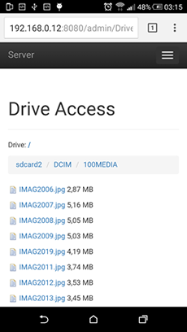
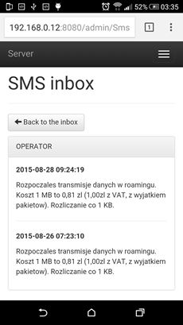

# Android HTTP Server

Small but powerful multithreaded web server written completely in Java SE and then ported to Android.

[](https://travis-ci.org/piotrpolak/android-http-server)
[](https://codecov.io/gh/piotrpolak/android-http-server)
[](https://www.codacy.com/app/piotrpolak/android-http-server)

The server implements most of the HTTP 1.1 specification and provides custom servlet API that can be
used to handle dynamic pages. The servlet API is designed after the official `javax.servlet` API
yet it is not compatible. Dynamic pages support cookies, sessions, file uploads and anything else
to build a common web application.

## Key features

* Small footprint, requires no external libraries
* Handles HTTP requests in separate threads
* Provides custom servlets API for generating dynamic content
* Supports GET, POST, HEAD methods (or more, depending on the configuration)
* Supports chunked transfer type
* Provides full support for mime types (uses Apache like mime.type)
* Supports buffered file upload (multipart requests), cookies, persisted sessions
* Supports serving partial body (ranges)
* Can serve static content both from file system and APK resources

## Building application

The provided Gradle wrapper should be used to build the application:

```bash
./gradlew build
```

## The http subproject and the idea behind it

The [http](../../tree/master/http/) subproject is the heart of the application and it is
independent on Android platform.

In fact the Android app was just an attempt to find a more practical use of the experimental HTTP
protocol implementation.

One of the design goals was to keep the resulting artifact **small in size** and minimalistic
in terms of dependency on other libraries - **it does not require any third party component**,
all HTTP protocol implementation is based on parsing data read from raw TCP sockets.

All application code is targeted to Java 7. It also compiles for Android SDK versions < 19
(try with resources is not supported, use
[IOUtilities.closeSilently(closeable)](../../tree/master/http/src/main/java/ro/polak/http/utilities/IOUtilities.java)
in a `finally` block as an alternative when closing streams).

Once the [ro.polak.http](../../tree/master/http/src/main/java/) package is mature enough it will be
released as an independent artifact.

The subproject can be tested in the following way:

```bash
./gradlew :http:clean :http:check -PskipAndroidBuild
```

The original package code has been refactored and covered with unit and integration tests.
Code coverage should be kept above 90%.

## Mutation testing

Mutation tests can be run by executing the following command:

```bash
./gradlew :http:clean :http:pitest -PskipAndroidBuild
```

The results can then be found under `http/build/reports/pitest/ro.polak.http/index.html` and
`http/build/reports/pitest/ro.polak.http/mutation.xml`.

## Running standalone server (CLI)

Standalone server can be used to bundle the `http` subproject into a runnable server implementation.
The CLI subproject is also independent on the Android platform, it is not bundled with the main APK.

```bash
./gradlew :cli:bootRun -PskipAndroidBuild
```

It is also possible to build one "uber-jar" and to use it as a standalone application:

```bash
./gradlew :cli:fatJar -PskipAndroidBuild
```

The resulting artifact can then be grabbed from `./cli/build/libs/cli-all.jar`.

The standalone server jar can be run on any machine with the following command:

```bash
java -jar ./cli/build/libs/cli-all.jar
```

## Sample code

### Hello World servlet

```java
package example;

import ro.polak.http.servlet.HttpServletRequest;
import ro.polak.http.servlet.HttpServletResponse;
import ro.polak.http.servlet.HttpServlet;

public class HelloWorld extends HttpServlet {

    @Override
    public void service(HttpServletRequest request, HttpServletResponse response) {
        response.getWriter().print("Hello World!");
    }
}
```

## Request logging servlet

```java
package example;

import java.io.IOException;

import ro.polak.http.exception.ServletException;
import ro.polak.http.servlet.Filter;
import ro.polak.http.servlet.FilterChain;
import ro.polak.http.servlet.FilterConfig;
import ro.polak.http.servlet.HttpServletRequest;
import ro.polak.http.servlet.HttpServletResponse;

public class RequestLoggingFilter implements Filter {
    
    private static final Logger LOGGER = Logger.getLogger(RequestLoggingFilter.class.getName());

    @Override
    public void init(FilterConfig filterConfig) throws ServletException {
        // Do nothing
    }

    @Override
    public void doFilter(HttpServletRequest request, HttpServletResponse response,
                         FilterChain filterChain) throws IOException, ServletException {
        LOGGER.fine("Handling incoming request " + request.getRequestURL());
        
        filterChain.doFilter(request, response);
    }
}
```

Example servlets can be found in [http/src/main/java/example](../../tree/master/http/src/main/java/example).

A practical use of filters can be checked at
[app/src/main/java/admin/filter/SecurityFilter.java](../../tree/master/app/src/main/java/admin/filter/SecurityFilter.java)
and 
[app/src/main/java/admin/filter/LogoutFilter.java](../../tree/master/app/src/main/java/admin/filter/LogoutFilter.java)

## Deployment descriptor - creating servlet contexts and mapping servlets to URLs

Each servlet must be mapped to an URL similar to `web.xml` manner.

```java
package example;

import java.util.List;
import java.util.regex.Pattern;

import ro.polak.http.configuration.DeploymentDescriptorBuilder;
import ro.polak.http.configuration.ServerConfig;
import ro.polak.http.session.storage.SessionStorage;

class DeploymentDescriptorFactory {
    public List<ServletContextWrapper> buildDeploymentDescriptor(SessionStorage sessionStorage,
                                                    ServerConfig serverConfig) {
        
        return DeploymentDescriptorBuilder.create()
                   .withSessionStorage(sessionStorage)
                   .withServerConfig(serverConfig)
                   .addServletContext()
                       .withContextPath("/example")
                       .addFilter()
                           .withUrlPattern(Pattern.compile("^.*$"))
                           .withUrlExcludedPattern(Pattern.compile("^/(?:Login|Logout)"))
                           .withFilterClass(SecurityFilter.class)
                       .end()
                       .addFilter()
                           .withUrlPattern(Pattern.compile("^/Logout$"))
                           .withFilterClass(LogoutFilter.class)
                       .end()
                       .addServlet()
                           .withUrlPattern(Pattern.compile("^/Index$"))
                           .withServletClass(Index.class)
                       .end()
                       .addServlet()
                           .withUrlPattern(Pattern.compile("^/$"))
                           .withServletClass(Index.class)
                       .end()
                   .end()
                   .build();
    }
}
```

## Screens






### 500 error page trace


## Sample script to send SMS using wget

If you want to send a real SMS please remove "&test=1" from the POST params.

```bash
SERVER_IP=192.168.1.1; SERVER_PORT=8080; \
    echo "Phone number:"; read TO; echo "Message:"; read MESSAGE; \
    wget -qO- --post-data "to=$TO&message=$MESSAGE&test=1" \
    http://$SERVER_IP:$SERVER_PORT/api/1.0/sms/send
```

# Icons

Android HTTP server uses icons from the beautifully designed "Farm-Fresh Web Icons" pack by
FatCow Web Hosting! These icon sets are licensed under a
[Creative Commons Attribution 3.0 License](https://creativecommons.org/licenses/by/3.0/).
