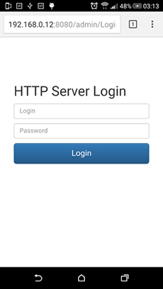
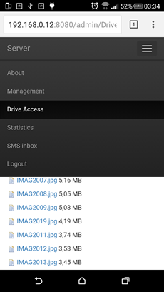
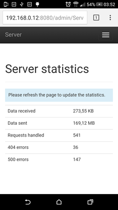

# Android HTTP Server

Small but powerful multithread web server written completely in Java SE and then ported to Android.

The server implements most of the HTTP 1.1 specification and ses its own specification of Servlets for handling dynamic pages.
Servlets supports cookies, sessions, file uploads and anything else to build a common web application.

It can be used as a standalone web server for static content or as a remote application back-office engine that can be accessed from web.

## Key features

* Small footprint, requires no external libraries
* Handles HTTP requests in separate threads
* Supports dynamic pages via Servlets (own specification)
* Implements Servlet Pool for memory optimisation and resource reuse
* Support for GET, POST, HEAD methods
* Supports KEEP-ALIVE connections
* Full support for mime types (uses Apache mime.type)
* Supports buffered file upload (multipart requests)
* Exposes compact API for handling sessions

## Screens

### 500 error page trace

